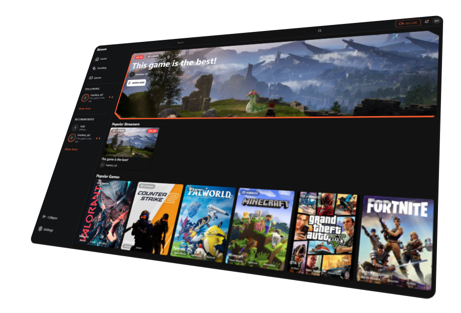
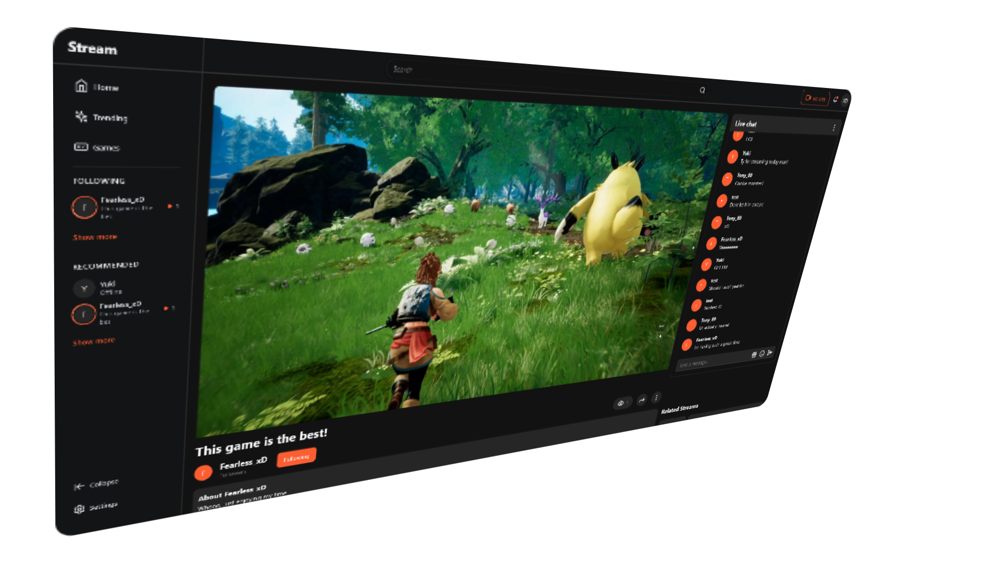
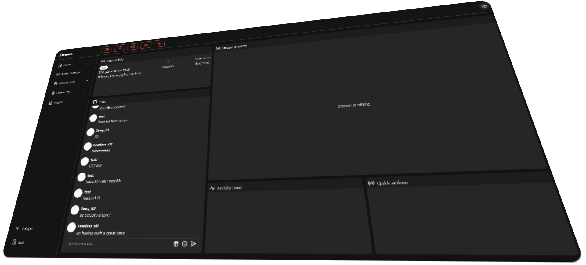

# Livestreaming Platform README

Welcome to this livestreaming platform repository! This platform is designed to provide a seamless streaming experience for both streamers and viewers. Below you'll find essential information about the structure of our platform, its functionalities, and how to set it up.

If you're looking for a fully finished, bug-free version of this platform or a completely custom livestreaming solution, take a look at my [Custom Development Offer](#custom-development-offer).

## Table of Contents
1. [Images](#images)
2. [Overview](#overview)
3. [Folder Structure](#folder-structure)
4. [Functionalities](#functionalities)
5. [Recommendation Algorithm](#recommendation-algorithm)
6. [Setup](#setup)
7. [What I'm Still Planning on Adding](#what-im-still-planning-on-adding)
8. [Important Notes](#important-notes)

## Images

## Overview
This livestreaming platform offers a comprehensive solution consisting of a backend, database, and frontend components. The backend utilizes the RTMP Node Media Server, which has been heavily customized to enhance security and update viewer counts and stream status in the database. The database is built using Pocketbase. Our frontend incorporates Tailwind CSS and modified ShadCN Components to create a sleek and intuitive user interface.

## Folder Structure
- **/backend/**: Contains the modified RTMP Node Media Server.
- **/database/**: Houses the Pocketbase database.
- **/frontend/**: Includes the frontend components built with Tailwind CSS and modified ShadCN Components.

## Functionalities
This platform offers the following main pages (although some are still under development):
- `/`: Home page.
- `/games`: View all available games.
- `/login`: Login page.
- `/register`: Register page.
- `/dashboard/`: User dashboard.
- `/dashboard/stream`: Stream overview for streamers, featuring chat, stream statistics, and customizable layout.

## Recommendation Algorithm
We have implemented a simple recommendation algorithm to suggest livestreams based on user interactions. The algorithm assigns scores to various actions:
- `view`: +1
- `like`: +2
- `share`: +3
- `follow`: +4 (on a livestream)
- `chat`: +2

Livestreams are sorted based on their scores, with higher scores indicating higher relevance.

## Setup
[Installation docs](https://github.com/R1ck404/livestreaming_platform/blob/main/Installation.md)

## What Im Still Planning on Adding

This platform is continuously evolving, and there are several features and pages that I am planning to add to enhance user experience and functionality. Here's what's on the horizon:

### Missing Pages
- **Privacy Policy**: A page dedicated to explaining how we handle user data and privacy.
- **Terms of Service (ToS)**: Detailed terms outlining the use of our platform.

### Additional Functionalities
- **Dark Mode**: An option for users to switch to a darker color theme to reduce eye strain and improve accessibility.
- **Custom Themes**: Allowing users to customize and personalize their UI with themes beyond the standard and dark modes.
- **Optimization and Responsiveness**: Many of our pages are currently not optimized for all devices and lack responsiveness. I am planning to enhance the UI and UX to ensure a seamless experience across all devices and screen sizes.
  
### Ongoing Changes
The following areas are targeted for ongoing optimization and improvement:
- **Performance Enhancements**: Continuous efforts to improve the platform's performance, reducing load times and ensuring smoother streaming experiences.
- **Security Measures**: Further enhancements to security measures to protect user data and prevent unauthorized access.
- **User Interface Improvements**: Regular updates to the UI to make it more intuitive and user-friendly, based on user feedback and usability testing.
- **Subscriptions**: A feature to allow users to subscribe to their favorite streamers for exclusive content.
- **Wallet**: A digital wallet feature for users to manage their transactions and subscriptions.
- **Settings**: A comprehensive settings page for users to customize their experience according to their preferences.

This roadmap is an open document, and we welcome contributions and suggestions from the community. Our goal is to create the best possible livestreaming platform that meets the needs of our users and exceeds their expectations.

Stay tuned for updates as we continue to build and improve our platform. Your support and feedback are invaluable to us as we strive to make our livestreaming platform your go-to destination for quality content and community interaction.

## Important Notes
- Our livestreaming system uses JWT keys to connect livestreams (e.g., OBS) to users. The backend validates these keys, and incorrect keys will result in users being kicked from the streaming session.
- JWT keys expire every hour.
- This platform is a work in progress. While it supports major functionalities such as streaming and dashboard features, optimizations and additional functionalities are still needed.

## Custom Development Offer
After receiving a request to add specific features to this platform, I realized there is interest in a more complete solution. Therefore, I am offering custom development services:
- Enhanced Livestreaming Platform: I can develop a fully finished, bug-free version of this platform for $1,000 - $2,000.
- Fully Custom Livestreaming Platform: I can create a bespoke livestreaming platform tailored to your specific needs for $4,000 - $8,000.

Contact me through [Discord](https://discordapp.com/users/1018787870082867241) or my [Portfolio](https://www.rickhuijser.com/contact)

*Note: The development of these features and pages will be done with the community in mind, ensuring that we provide a platform that is inclusive, accessible, and enjoyable for everyone.*

Feel free to contribute to the development of this livestreaming platform! If you have any questions or feedback, please don't hesitate to reach out.

*The base of this livestreaming platform was created by me in 24 hours.*
*The changes to this livestreaming platform were made by me in 7 hours.*

Happy streaming! 🎥🚀
